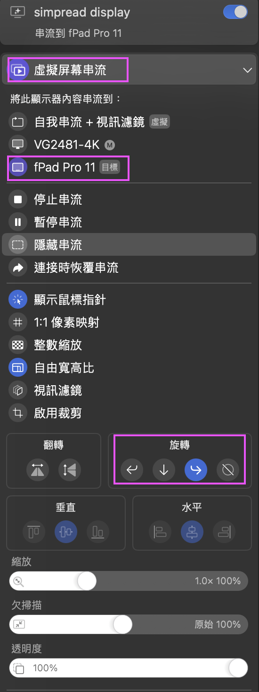

# iPad Pro 上用简悦标注网页的尝试与总结
听说可通过安装 Orion 浏览器在 iPhone/iPad 上使用 Chrome 插件，但简悦插件功能无法触发。近日与作者交流得知，有用户发现只要把网站设置到简悦插件的白名单内便可激活简悦的功能，不过并非所有网站适用。目前在苹果移动设备上流畅使用简悦，只能让欧盟法规推动（逼迫？）苹果开放三方浏览器支持了😀。
经过多次尝试，我找到了两种在 iPad Pro 上用简悦标注网页的有效方法。在作者的鼓励下，我把自己在 iPad Pro 上用简悦标注网页的方法整理出来了，用着感觉还挺不错。

## 一、直接用 macOS 的随航功能，iPad Pro 上用简悦搭配 Apple Pencil 标注网页
搭载 M2 及以上芯片的 iPad Pro，配合 Apple Pencil 会有（hover）悬停功能。我手上的M2 iPad Pro正好有此功能。
只要iPad Pro在Mac设备附近时，开启 macOS 的 Sidecar （随航）功能后，无论是把 iPad Pro 作为 Mac 的屏幕镜像，还是扩展屏幕，都能用 Apple Pencil 控制 Mac 鼠标的位置。仿佛笔就成了没有触屏macOS的mouse，只要 Mac 上的浏览器不是 Safari 和 Firefox，而是安装了简悦插件的 Chrome 浏览器，便可如常对文章进行标注了，有点在书本看书下标注的体验。

个人用着感觉可能比在 Windows 平板上用笔标注舒服多了（有经验的朋友可以分享一下）。而且不像有些 iPadOS 应用，拿笔的手全放在 iPad Pro 屏幕上时会有误触的情况。
### 缺点：
* 用 Apple Pencil 没法直接手写输入文字。
* 说到底，就是把实体鼠标换成了实体 Apple Pencil，简悦标注时的那些老问题还是能遇到。
<!-- -->

### 补充：
我的Mac设备是 M1 版 MacBook Air。在家里，通过Type-C 外接优派 VG2481-4K 显示器上使用。不过这个显示器有点麻烦，用一根 Type-C 连接 MacBook 时，熄屏和 MacBook 充电这两个功能不能单独控制。但最近 macOS 软件Better Display 更新后 ，可以用它的 “关闭屏幕灯” 功能，还能继续给 MacBook 充电。

## 二、用 Better Display 实现 iPad Pro 竖屏阅读简悦优化过的网页
用 Better Display 的另一个功能，把 sidecar时的iPad Pro 画面变成竖屏，搭配简悦 插件让我平时躺着床看网页文章仍继续可以标注。如何令iPad Pro成了竖屏的方法（四个步骤）：

第一步新建虚拟屏

第二步选出你的副屏类型（此处按我需求选择iPad Pro）

第三步选择”旋转方向”

第四步”虚拟屏幕串流”，把虚拟屏幕串流到iPad Pro，最后再选择”旋转”的方向.

不过用 Apple Pencil 没法直接进行标注。这是因为 Better Display 让 iPad Pro 竖屏时采用串流模式显示，Pencil 只能控制 iPad Pro 屏幕上的鼠标，没办法直接控制传输过来的虚拟屏幕鼠标。

## 最后
其实成文前我还是很期待iPad上用Orion 浏览器通过简悦设白名单的方法激活简悦功能，这比我要配上MacBook才能用随身使用上方便太多，但很多主流网站即便加入白名单也无法正常使用，这才促使我不断探索其他替代方案。希望分享我的方法后，激起更多用户共同探索更优解，若大家有新发现或更好的方法，欢迎随时交流分享，一起完善在iPad Pro上使用简悦标注网页的体验。
